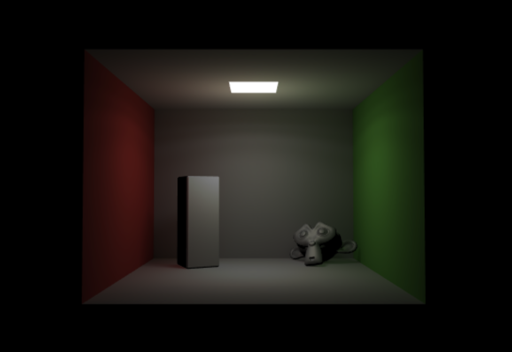
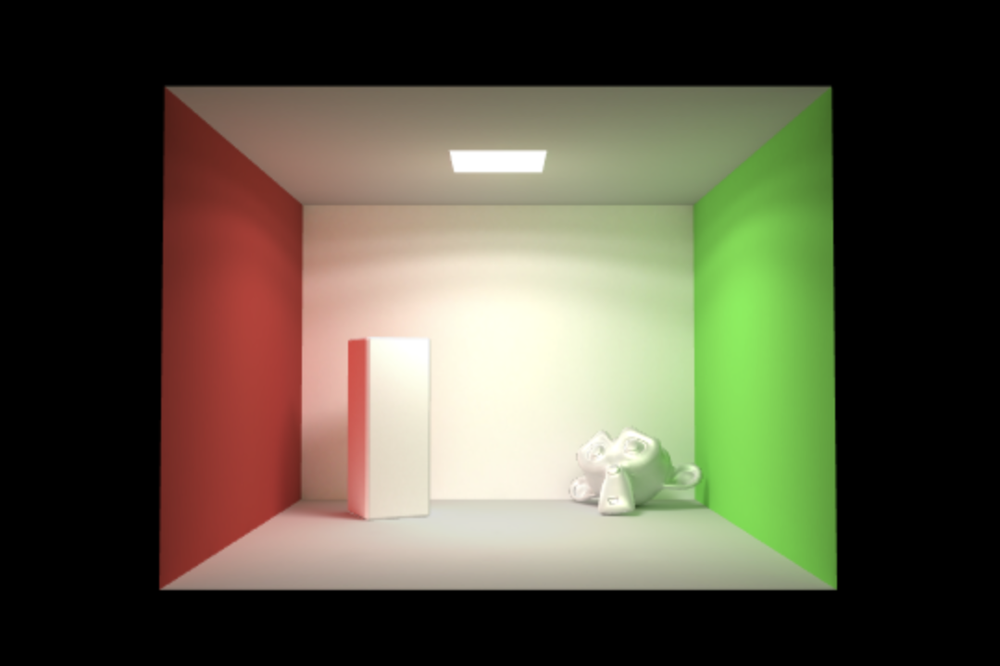

# webgl-radiosity

Implement radiosity by WebGL.

Use a hemicube algorithm for radiosity rendering in WebGL.

## Run

### Install Dependencies

You need install [yarn](https://www.yarnpkg.com/zh-Hans/) or [nodejs with npm](https://nodejs.org/en/) firstly.

```sh
yarn global add live-server
# or
# npm install live-server -g
```

### Dev

```sh
yarn dev
```

## ref

- [Babylon](https://github.com/BabylonJS/Babylon.js)
- <https://github.com/jsarabia/Radiosity-WebGL>
- [[WIP] Radiosity solver for baking global illumination on static geometry #6793](https://github.com/BabylonJS/Babylon.js/pull/6793)

## Todo

- [ ] tell when complete
- [ ] download jpg/png
- [ ] mouse drag

### Contrast Demo by Babylon

[Babylon-Light-Demo](https://codepen.io/YunYouJun/pen/VwYMKMy)

Simple light



If you uncomment lines 34-36, you will get this.


