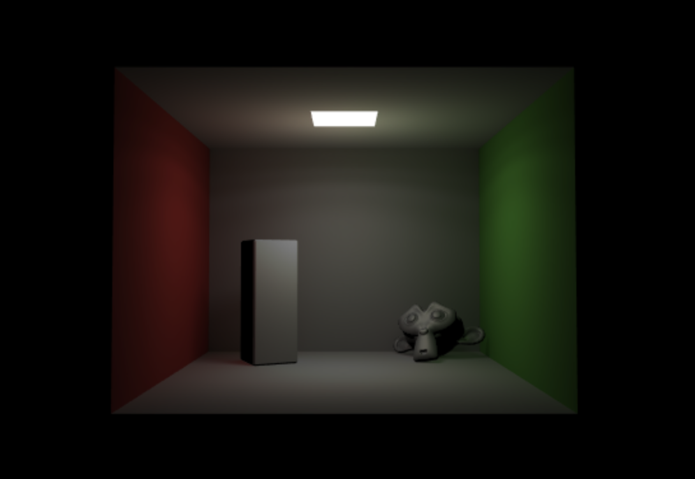
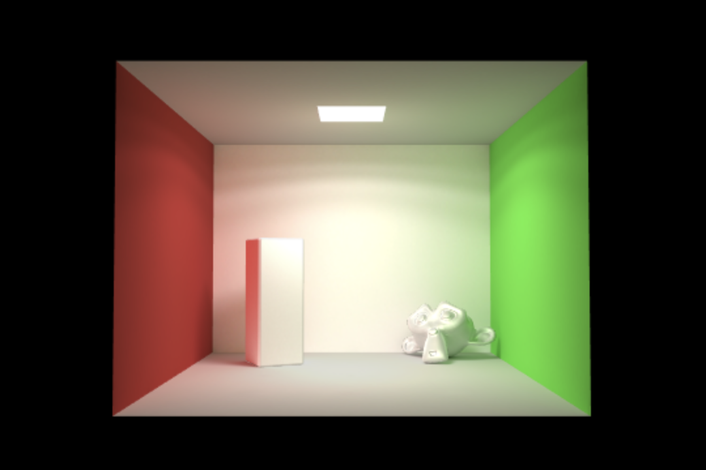

# Technical Report

WebGL Radiosity

## Function

## Module

## Core Algorithm

### Contrast Demo by Babylon

[Babylon-Light-Demo](https://codepen.io/YunYouJun/pen/VwYMKMy)

Simple light

If you uncomment lines 34-36, you will get this.

## Performance analysis

...
